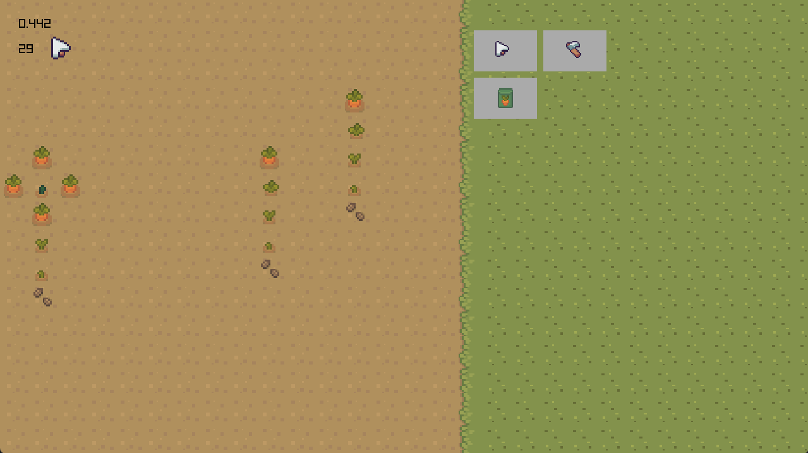

## LD 58

_Theme_: Collector
_Where_: https://ldjam.com/events/ludum-dare/58

## How to "play"

The mouse You can click the "seeds" button to plant seeds in the play area (the "dirt" on the left). They will grow. There are different patterns and timing involved in getting _new_ plants to grow. You can use the "scythe" button to allow the "removal" of plants.

You can use the "cursor" button to _**click**_ on the existing plants to help them grow faster and help with timing of patterns.

The game will "tick" and the plants grow on each tick. Each plant has a number of ticks needed to grow to the next stage. Sometimes other plants grow depending on the pattern of the surrounding tiles and the stage of the plants on those tiles.

There isnt really a win or lose condition. But it is fun to see the plants grow.

### Quick Setup

The repo includes built binaries for both Windows/Linux _amd64_ using the latest nightly build of Odin found [here](https://github.com/odin-lang/Odin/releases). The binaries were built using `odin build .`.

#### Binary Downloads

- Linux: [linux_amd64_ld58](./bin/linux_amd64_ld58)
- Windows [win11_amd64_ld58](./bin/win11_amd64_ld58.exe)

### Idea

I have been looking for a good reason to tinker with Odin-lang. LD is the perfect time to do that.

The idea was a sort of farming simulation / incremental game about collecting different types of plants based on patterns and time. I'm not sure that there is much of a loss condition but it seems fun to click things etc.

While I did not not finish the game I think some of the "bones" are there. There are a several

## License

**Code:** Licensed under the [MIT License](./LICENSE_CODE.txt).
You may use, modify, and redistribute the source code with proper attribution.

**Assets (art, music, etc.):** © 2025 Various
These are not open source and may not be redistributed or reused outside this project.
without explicit permission. See [LICENSE_ASSETS.txt](./LICENSE_ASSETS.txt).
